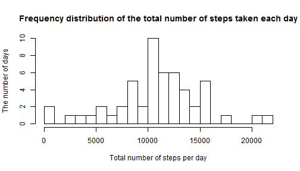
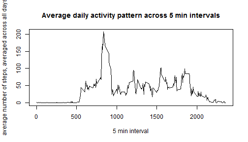
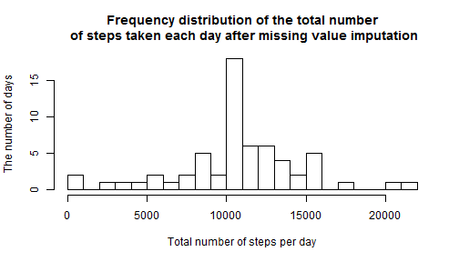
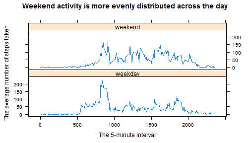

# Analyzing the activity monitoring data set

## Loading and preprocessing the data


```r
activity <- read.csv("activity.csv", stringsAsFactors = F)
```

## What is mean total number of steps taken per day?

Let's write a code that calculates total number of steps taken per day


```r
library(dplyr)
total_steps<- activity[complete.cases(activity),] %>% group_by(date) %>% summarise(total_steps = sum(steps,na.rm = TRUE))
mean_total <- mean(total_steps$total_steps)
median_total <- median(total_steps$total_steps)
```

Let's make a histogram of the total number of steps taken each day:


```r
hist(total_steps$total_steps, breaks = 16, main = "Frequency distribution of the total number of steps taken each day", xlab = "Total number of steps per day",
     ylab = "The number of days")
```



Based on the activity data set, 
- the mean number of total steps taken per day is **1.0766189 &times; 10<sup>4</sup>**
- the median number of total steps taken per day is **10765**


## What is the average daily activity pattern?

Let's make a time series plot of the 5-minute interval (x-axis) and the average number of steps taken, averaged across all days (y-axis)


```r
library(dplyr)
pattern <- activity %>% group_by(interval) %>% summarise(average_steps = mean(steps,na.rm = T))
max_steps <- pattern$interval[which(pattern$average_steps == max(pattern$average_steps,na.rm = T))]
plot(pattern$interval,pattern$average_steps, type = "l", main = "Average daily activity pattern across 5 min intervals", xlab = "5 min interval", ylab = "average number of steps, averaged across all days" )
```



Based on this plot, the interval number **835** contains the maximum number of steps, on average across all the days in the dataset.

## Imputing missing values

There are a number of days/intervals where there are missing values (coded as NA). The presence of missing days may introduce bias into some calculations or summaries of the data.

Therefore, let's calculate and report the total number of missing values in the dataset (i.e. the total number of rows with NAs)


```r
missing_data <- sum(!complete.cases(activity))
```

There are **2304** missing values in the activity data set.

Let's impute all of the missing values in the dataset. 

**I choose to impute them by using the mean steps for that 5-minute interval the missing values belong to.**

Let's create a new dataset that is equal to the original dataset but with the missing data filled in.


```r
activity_NAimputed <- activity
activity_NAimputed <- merge(activity_NAimputed, pattern, by= "interval", all = T, sort = FALSE )
activity_NAimputed <- activity_NAimputed %>% arrange(date, interval)
activity_NAimputed$steps[!complete.cases(activity_NAimputed)] <- activity_NAimputed$average_steps[!complete.cases(activity_NAimputed)]
```

Let's make a histogram of the total number of steps taken each day: 


```r
library(dplyr)
totalsteps_perday <- activity_NAimputed %>% group_by(date) %>% summarise(totalsteps = sum(steps))
mean_total_imputed <- mean(totalsteps_perday$totalsteps)
median_total_imputed <- median(totalsteps_perday$totalsteps)
hist(totalsteps_perday$totalsteps, breaks = 16, main = "Frequency distribution of the total number\n of steps taken each day after missing value imputation", xlab = "Total number of steps per day",
     ylab = "The number of days")
```




After the missing value imputation, 

- the mean number of total steps taken per day is **1.0766189 &times; 10<sup>4</sup>**
- the median number of total steps taken per day is **1.0766189 &times; 10<sup>4</sup>**

**I found that after missing value imputation the mean was unchanged compared to the mean calculated by ignoring the missing data. However, the median has changed and become equal to the mean.**

## Are there differences in activity patterns between weekdays and weekends?

Let's use the imputed data set to answer this question. 


```r
library(dplyr)
library(lattice)
activity_NAimputed$days <- weekdays(as.Date(activity_NAimputed$date))
activity_NAimputed$day_category <- ifelse(activity_NAimputed$days == "Saturday"|activity_NAimputed$days == "Sunday", "weekend", "weekday")

pattern_days <- activity_NAimputed %>% group_by(day_category, interval) %>% summarise(average_steps = mean(steps))
pattern_days <- transform(pattern_days, day_category = factor(day_category))


xyplot(average_steps ~ interval | day_category, data = pattern_days, type = "l",
       layout = c(1,2), xlab = "The 5-minute interval", ylab = "The average number of steps taken", main = "Weekend activity is more evenly distributed across the day")
```



